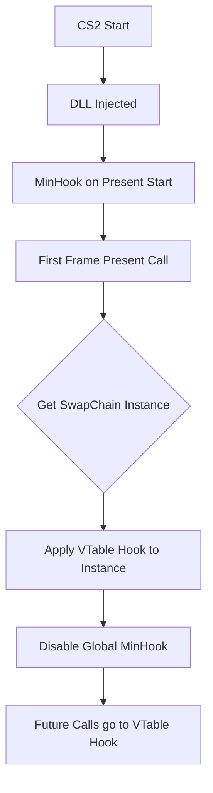
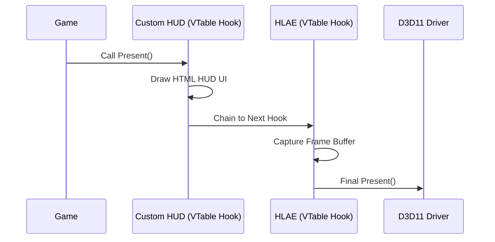
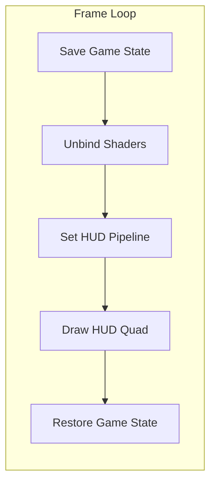

# CS2 Client HUD: Technical Overview

This document explains the internal architecture of the CS2 Client HUD, focusing on how it interacts with the Source 2 engine (DirectX 11) and HLAE for recording.

## 1. The Hooking Strategy: "Hybrid Hook"

Injection into a game like CS2 requires intercepting the graphics pipeline. We use a **Hybrid Hooking** approach to ensure the HUD is both visible on screen and captured in high-quality recordings (HLAE).

### The Challenge
*   **MinHook (Function Hooking)**: Modifies the start of a function (like `IDXGISwapChain::Present`) with a `JMP` instruction. This is great for finding the function but doesn't guarantee execution order if other tools (like HLAE) also hook it.
*   **VTable Hooking**: Modifies the "Virtual Function Table" of a specific object instance. This is more "local" and harder for some anti-cheats to detect, but requires an existing object pointer.
*   **HLAE Conflict**: HLAE records by grabbing the frame during `Present`. If we draw *after* HLAE, the HUD is visible to you but missing from the video files.

### The Solution: Hybrid Hook

1.  **Stage 1 (Discovery)**: We use MinHook to catch the game's `Present` call globally...

### The Chain

---

## 2. The Rendering Pipeline (D3D11)

### Rendering Lifecycle

CS2 uses DirectX 11. To draw an overlay, we must "interrupt" the game's rendering cycle...

### State Management (`D3D11StateSaver`)
Source 2 is a modern, high-performance engine that uses complex GPU states (multisampling, specific shader types, custom buffers). If we just start drawing our HUD, we will corrupt the game's state, leading to flickering, missing polygons, or immediate crashes.

We implemented a **State Saver** that performs the following:
*   **Capture**: Saves every single active pipeline state (Shaders, Viewports, Scissor Rects, Blend States, etc.).
*   **Airgap**: We explicitly unbind all game shaders (Vertex, Pixel, Geometry, Compute) to ensure our 2D quad doesn't get messed up by the game's 3D logic.
*   **Restore**: After our HUD is drawn, we "put everything back exactly where it was" before returning control to the game.

### The Draw Call
We render the HUD as a single **Fullscreen Quad** (two triangles forming a rectangle).
1.  **Ultralight**: Renders the HTML/CSS to an internal memory buffer.
2.  **Texture Update**: We copy that buffer into a D3D11 Texture.
3.  **Pixel Shader**: Samples the texture and draws it onto the screen.

---

## 3. Ultralight Integration

[Ultralight](https://ultralig.ht/) is a lightweight web renderer. It allows us to build the HUD using modern web tech (React/Typescript) while staying inside the game's memory.

*   **Initialization**: We manually set up "Platform Handlers" (FileSystem, FontLoader) because a DLL inside a game doesn't have a standard window environment.
*   **Synchronization**: Ultralight logic runs at its own speed, and we sync it with the game's frame rate during the `Present` hook.

---

## 4. Stability & Shutdown

The most common cause of crashes in DLL injection is **Process Termination**.

### The "Destructor Race"
When you close CS2, the game forcefully unloads all DLLs. If we have global objects (like `HudRenderer g_Renderer;`), the C++ runtime tries to call their destructors *after* the graphics drivers might already be gone. This causes an "Access Violation".

### Our Fixes
1.  **Pointer lifetime**: `g_Renderer` is a pointer. We `new` it on load.
2.  **Safe Detach**: In `DLL_PROCESS_DETACH`, we check `lpvReserved`. If the process is terminating, we **leak the memory intentionally**. We don't call any cleanup code. This lets the OS reclaim the memory safely without running any dangerous code in an unstable process state.

---

## 5. Problems Encountered & Lessons Learned

Developing an internal overlay for a high-performance engine like Source 2 presented several technical hurdles.

### A. The "Invisible HUD" (Hook Order Race)
*   **Problem**: The HUD was clearly visible on the player's monitor, but the final HLAE video files were missing it entirely.
*   **Why**: HLAE captures the frame by hooking `Present`. Our initial `MinHook` implementation was being called *after* HLAE had already saved the frame.
*   **Failed Solution**: Simply changing the hook priority didn't work because HLAE uses VTable hooks which are "closer" to the object.
*   **Fix**: The **Hybrid Hook**. We use MinHook just to find the object, then manually overwrite the VTable to ensure we are the *first* in line. We draw our HUD, then "chain" the call to whatever was there before us (HLAE).

### B. "Raw Files Not Found" (Breaking the Chain)
*   **Problem**: After fixing visibility, HLAE started failing to record entirely, throwing "Raw files not found" errors.
*   **Why**: Our VTable hook was calling the *original driver function* (`oPresent` trampoline) instead of the *original VTable pointer*. This "jumped over" HLAE's hook, effectively disabling HLAE's capture logic.
*   **Fix**: We now store `g_oPresentVTable` (the address HLAE was using) and call that specifically. 

### C. The "Crash on Exit" (DLL Lifecycle)
*   **Problem**: The game worked perfectly but crashed 100% of the time when closing.
*   **Why**: Global C++ objects have their destructors called during `DLL_PROCESS_DETACH`. By that time, the D3D11 device or driver might already be unloaded by the OS. Calling `Release()` on a dead device causes an Access Violation.
*   **Fix**: Never use global objects for D3D resources in a DLL. We use a pointer and **intentionally leak it** if the process is terminating (`lpReserved != NULL`). The OS will clean up the memory anyway, and we avoid running dangerous destructor code.

### D. Graphics Pipeline Corruption
*   **Problem**: Drawing the HUD caused the game's world to flicker or turn black.
*   **Why**: Modern games use "Sticky States". If the game sets a "Compute Shader" and we then try to draw a 2D quad without unbinding it, the GPU tries to use a 3D shader to draw our 2D HUD.
*   **Fix**: `D3D11StateSaver`. We meticulously save the entire state, **explicitly nullify** every shader stage (VS, PS, GS, HS, DS, CS), draw our HUD, and then restore everything.

### E. Resolution & Render Target Mismatch
*   **Problem**: HUD was missing when recording at high resolutions.
*   **Why**: HLAE sometimes renders to an off-screen buffer that is larger than the window. If we only draw to the "BackBuffer" of the SwapChain, we miss this internal recording buffer.
*   **Fix**: We detect the currently bound Render Target using `OMGetRenderTargets`. If the game/HLAE has a buffer bound, we draw to that. If not, we fall back to the SwapChain.
